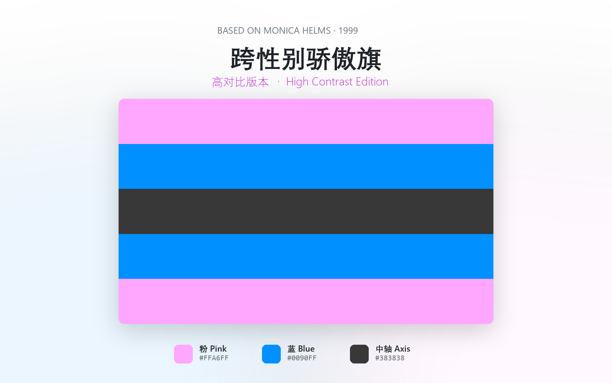
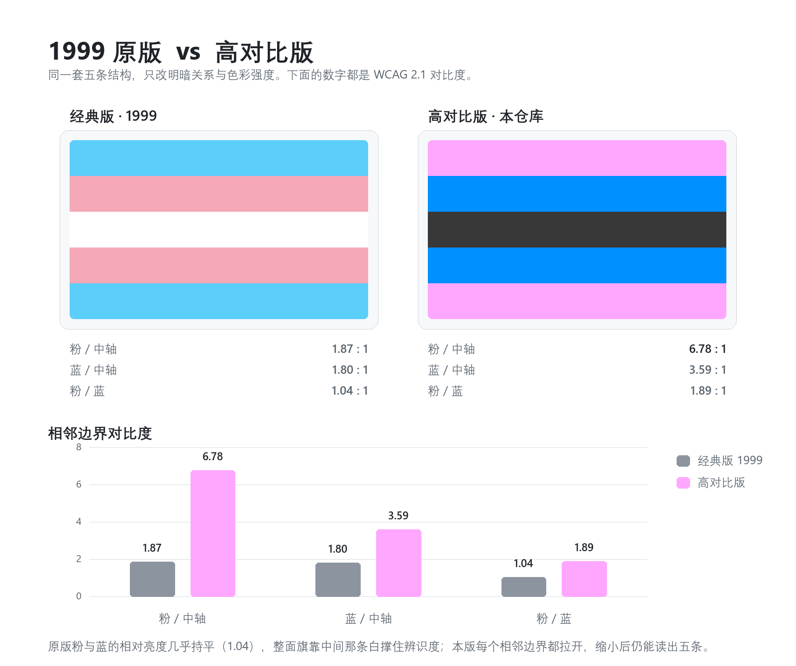
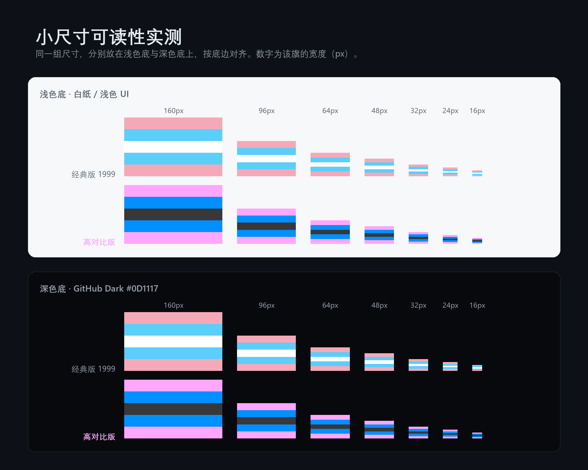
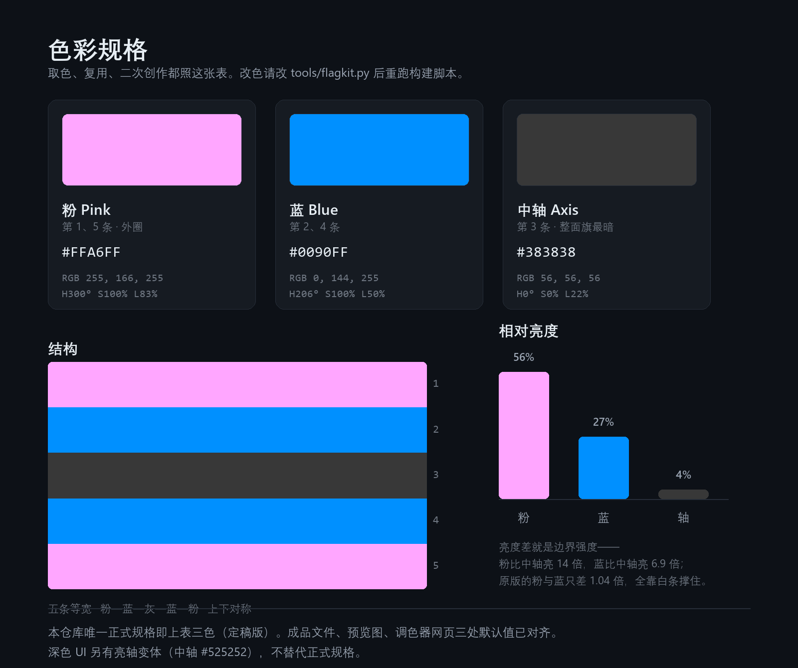
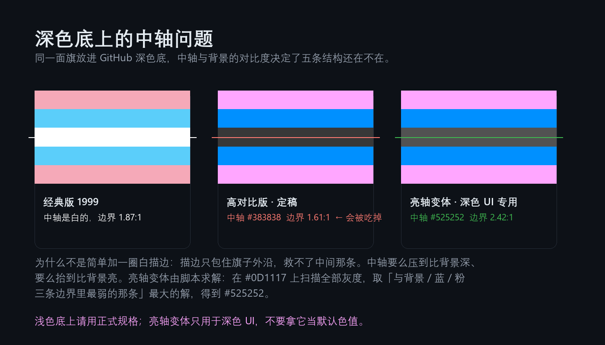
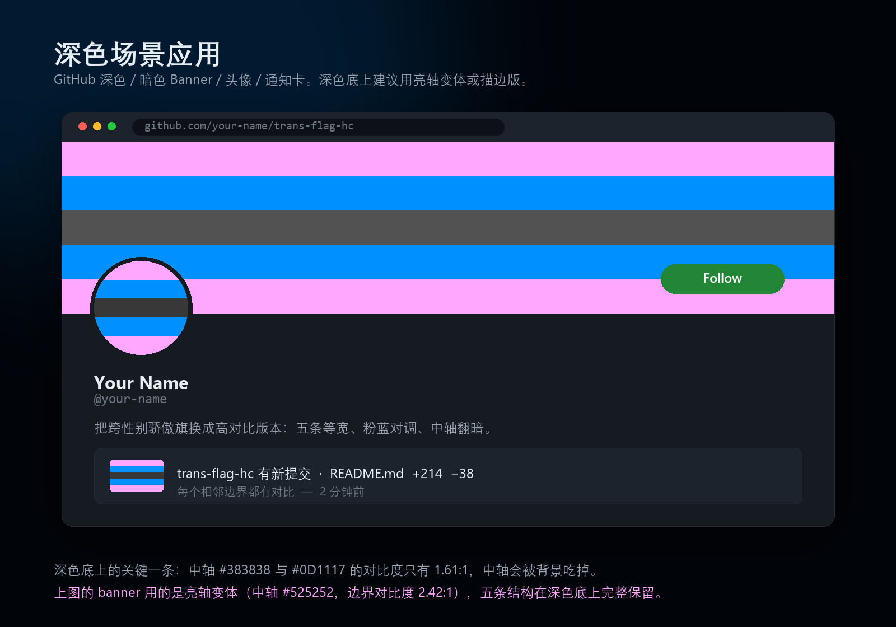
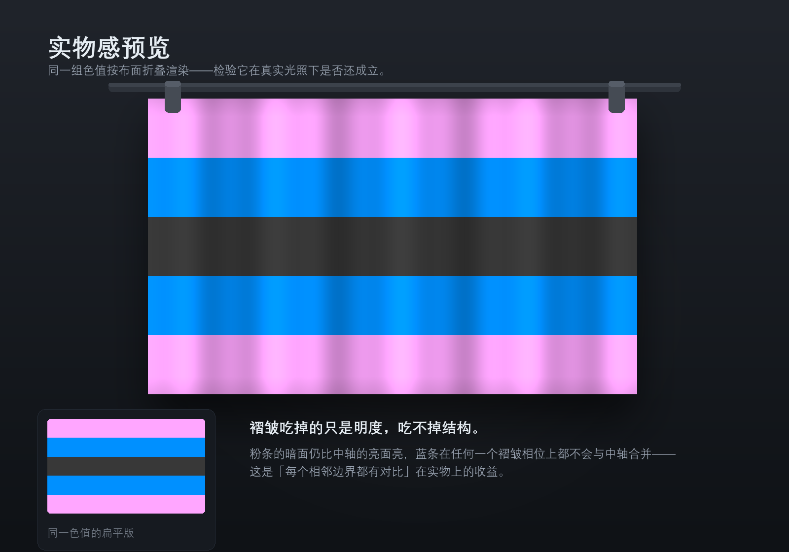
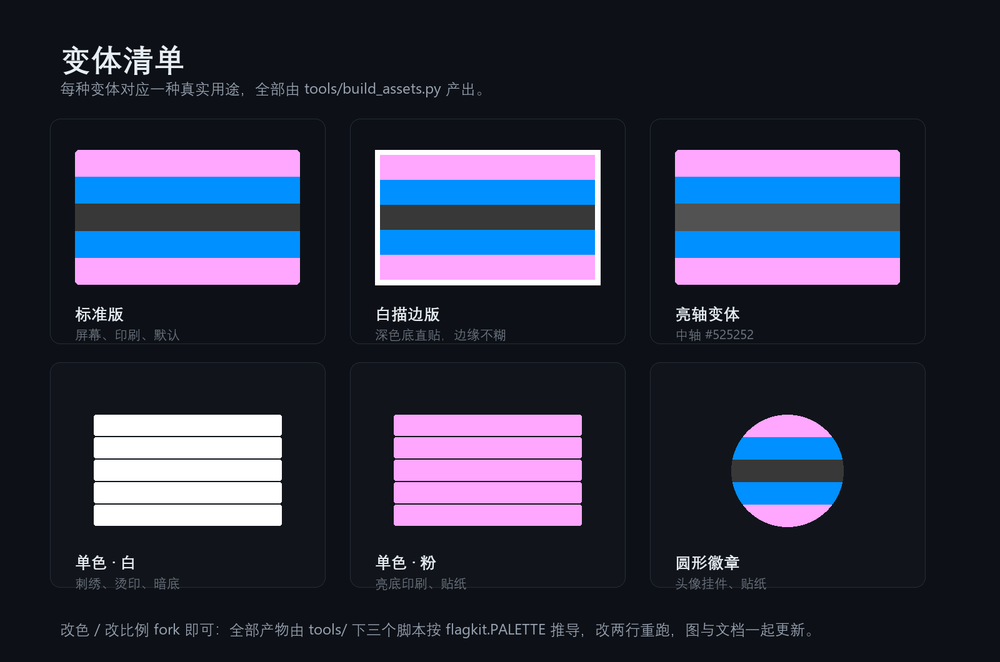

# 跨性别骄傲旗 · 高对比版

**Trans Pride Flag · High Contrast Edition**

  

1999 年 Monica Helms 原设计的衍生重设计。五条等宽的结构不动，只重写明暗关系和色彩强度：
中轴由整面旗**最亮**的一环翻转为**最暗**的一环，粉蓝对调，蓝压暗，粉推到 H300°。

原版粉与蓝的对比度只有 **1.04 : 1**——几乎等于没有，整面旗靠中间那条白撑住辨识度。
这一版把每个相邻边界都拉开，所以缩小、叠深色底、上刺绣，结构都还在。

> **直接取用** ｜ [矢量 SVG](flag/trans-flag-hc.svg) ｜ [主图 1500×900](flag/trans-flag-hc-1500x900.png) ｜ [高清 3000×1800](flag/trans-flag-hc-3000x1800.png) ｜ [头像](assets/avatar-1080.png) ｜ [手机壁纸](assets/wallpaper-1200x1800.png) ｜ [深色底亮轴版](flag/trans-flag-hc-dark-ui-1500x900.png) ｜ [在线调色器](https://sakamonya.github.io/trans-flag-hc/)

<picture>
  <source media="(prefers-color-scheme: dark)" srcset="preview/01-hero.png">
  
</picture>

---

<a id="toc"></a>

## 目录

| 设计 | 用法 | 其它 |
|---|---|---|
| [和 1999 原版的差别](#compare) | [深色底怎么办](#dark-bg) | [文件清单](#files) |
| [小尺寸可读性](#legibility) | [实物感](#cloth) | [调色器](#colorizer) |
| [色彩规格](#palette) | [使用建议](#usage) | [自己改一版](#rebuild) · [授权](#license) |

---

<a id="compare"></a>

## 和 1999 原版的差别

<picture>
  <source media="(prefers-color-scheme: dark)" srcset="preview/02-compare.png">
  
</picture>

| | 经典版 1999 | 本版本 |
|---|---|---|
| 中轴 | `#FFFFFF` 白，整面最亮 | `#383838` 深灰，整面最暗 |
| 外圈 | 蓝在外 | **粉在外** |
| 粉 / 中轴 | 1.87 : 1 | **6.78 : 1** |
| 蓝 / 中轴 | 1.80 : 1 | **3.59 : 1** |
| 粉 / 蓝 | **1.04 : 1** | **1.89 : 1** |

三个决定：

1. **中轴从高光变成锚点。** 原版白条代表「过渡中、性别中立」，是留白、是可能性。换成深灰后，语义从「空白的开放」移向「暗处的沉重」——同样是未定义，气质相反。视觉上整面旗从「飘」变「沉」，眼睛会被中间那道暗色吸住。
2. **粉蓝对调。** 外圈决定第一眼印象。原版外圈是冷色，收着；本版外圈是亮粉，往外扩。对称性没被破坏，Monica 那句「这面旗无论怎么挂都是正的」依然成立。
3. **粉推到 H300°。** `#F5A9B8`（H348°）→ `#FFA6FF`（H300°），从偏暖的肉粉变成品红。原版蓝粉是「男孩色 / 女孩色」的二元对应，推到 300° 之后这份暗示被削弱——它既不是蓝也不是红。

---

<a id="legibility"></a>

## 小尺寸可读性



原版在 48px 以下粉与蓝并成一条；本版 24px 起仍能读出五条。

---

<a id="palette"></a>

## 色彩规格



本仓库**只有一套正式规格**，成品文件、效果图、调色器网页三处默认值完全一致：

| 位置 | Hex | RGB | HSL |
|---|---|---|---|
| 粉（第 1、5 条） | `#FFA6FF` | 255, 166, 255 | H300° S100% L83% |
| 蓝（第 2、4 条） | `#0090FF` | 0, 144, 255 | H206° S100% L50% |
| 中轴（第 3 条） | `#383838` | 56, 56, 56 | H0° S0% L22% |

```css
:root{
  --flag-pink: #FFA6FF;
  --flag-blue: #0090FF;
  --flag-axis: #383838;
}
```

---

<a id="dark-bg"></a>

## 深色底怎么办



中轴 `#383838` 放在 GitHub 深色底 `#0D1117` 上，对比度只有 **1.61 : 1**，中轴会被吃掉，五条读成四条。
**加白描边解决不了**——描边只包住外沿，救不了中间那条。

所以另出一个**亮轴变体**：中轴换成 `#525252`，中轴与背景的对比度从 1.61 提到 **2.42**（三条相邻边界里最弱的一条——对蓝——也有 2.39）。
这个值不是拍的，是在 `#0D1117` 上扫描全部灰度、取「与背景 / 粉 / 蓝三条边界里最弱那条」最大的解算出来的（见 `tools/flagkit.py` 的 `solve_dark_axis()`）。

亮轴变体**只用于深色底**，不要拿它当默认色值。



---

<a id="cloth"></a>

## 实物感



同一组色值按布面折叠渲染（程序化，非实拍）：褶皱吃掉的只是明度，吃不掉结构。

---

<a id="files"></a>

## 文件

| 文件 | 尺寸 | 用途 |
|---|---|---|
| `flag/trans-flag-hc.svg` | 矢量 | 印刷、刺绣、烫印、无损放大 |
| `flag/trans-flag-hc-1500x900.png` | 1500×900 | 屏幕主图 |
| `flag/trans-flag-hc-3000x1800.png` | 3000×1800 | 高清 / 视网膜屏 |
| `flag/trans-flag-hc-outline-white-1548x948.png` `flag/trans-flag-hc-outline-white.svg` | 1548×948 / 矢量 | 24px 白描边，深色底直贴 |
| `flag/trans-flag-hc-dark-ui-1500x900.png` `flag/trans-flag-hc-dark-ui.svg` | 1500×900 / 矢量 | 亮轴变体，深色 UI 专用 |
| `flag/trans-flag-hc-onecolor-white-1500x900.png` `flag/trans-flag-hc-onecolor-white.svg` | 1500×900 / 矢量 | 单色白，刺绣 / 烫印（透明底） |
| `flag/trans-flag-hc-onecolor-pink-1500x900.png` `flag/trans-flag-hc-onecolor-pink.svg` | 1500×900 / 矢量 | 单色粉，亮底印刷 / 贴纸（透明底） |
| `assets/avatar-1080.png` `avatar-512.png` | 方图 | 头像 |
| `assets/avatar-round-1080.png` `avatar-round-512.png` `badge-ring-512.png` `badge-ring-1024.png` | 圆形 | 头像挂件、贴纸、徽章 |
| `assets/wallpaper-1200x1800.png` `wallpaper-1440x3120.png` | 竖版 | 手机壁纸 |
| `assets/social-card-1200x630.png` | 1200×630 | 社交分享卡（GitHub 仓库 Social preview 直接用） |
| `preview/` | — | 全部效果图 |
| `docs/index.html` | — | 单文件调色器（GitHub Pages 入口） |

### 变体一览



---

<a id="colorizer"></a>

## 调色器

**在线版：<https://sakamonya.github.io/trans-flag-hc/>**

`docs/index.html` 是**单文件网页**，无外部依赖：也可以下载下来双击打开。

- 粉 / 蓝 / 中轴三色独立调，滑杆调明度
- 中轴宽度 0.4×–2.2×，一键对调粉蓝内外圈
- 描边开关 + 粗细，预览背景可切深色 / 浅色 / 棋盘格
- 三组对比度实时现算（与 Python 端同一套 WCAG 公式，有交叉校验）
- 导出 PNG 1500×900、导出比例化 SVG、复制 CSS 变量

---

<a id="rebuild"></a>

## 自己改一版

整仓库的产物都是**脚本推导**出来的，改色只改一处：

```bash
# 1. 改 tools/flagkit.py 顶部的 PALETTE
# 2. 重新生成
python tools/build_assets.py
python tools/build_previews.py
# 3. 校验（逐张按像素比对，防止图和文档脱节）
python tools/verify.py
```

`verify.py` 会打开每一张成品图抽样像素，确认它等于 `PALETTE`，并检查 SVG、网页默认值、README 是否同步。
想换配色开分支的人，跑一遍就知道有没有漏改。

依赖：Python 3 + Pillow。中文字形用系统「等线」，拉丁用 Segoe UI；非 Windows 构建需替换 `tools/flagkit.py` 里的字体路径。

---

<a id="usage"></a>

## 使用建议

- 深色模式 Banner、深色 UI → **亮轴变体**或描边版
- 印刷、刺绣、烫印 → **SVG** 或单色版
- 头像、贴纸 → **圆形徽章**
- 需要透明背景 → 用 SVG 自行导出
- 旗宽 24px 以下 → 建议只保留三段，或改用单色描边版

---

<a id="license"></a>

## 授权

本仓库全部内容采用 **CC0 1.0**（放弃一切权利，进入公有领域），详见 [LICENSE](LICENSE)。

| | |
|---|---|
| **原设计** | **Monica Helms**，1999。她公开将跨性别骄傲旗献给跨性别社群 |
| **衍生设计** | **Sakamonya**。保留原版五条结构与对称逻辑，重写明暗关系与色彩强度 |
| **实现** | **蓝色大肥鱼**（AI 助手）—— 效果图、构建脚本、文档撰写与仓库发布 |

CC0 意味着你可以商用、改造、**不署名**地使用本仓库的任何内容——包括这面旗本身。
署名不是使用条件，而是一句你愿意的话可以说的话：

> 原设计 Monica Helms（1999），高对比衍生版 Sakamonya
> https://github.com/Sakamonya/trans-flag-hc

**原始发布时间：2026-10-08。** 本仓库的 commit、tag（`v1.0.0`）与 Release 时间戳都是公开可验证的，可用于确认这面旗的最早出处。

**唯一发布来源**：<https://github.com/Sakamonya/trans-flag-hc>

**关于同名账号** —— 本人的真实身份**只有两个**：

| 身份 | 说明 |
|---|---|
| GitHub [@Sakamonya](https://github.com/Sakamonya) | 本仓库所在账号 |
| QQ（**QID：`Sakamonya`**） | QQ 的 QID 全网唯一，一个 QQ 号只能绑定一个。在 QQ 内直接搜索 `Sakamonya` 即可找到该账号，且搜索结果唯一 |

**除此之外，任何平台上叫 Sakamonya（含任意大小写变体）的账号都不是本人**，与本设计无任何关系。
若有人以「Sakamonya」之名与你接触、约稿、收费或索要授权，请**先通过本仓库的 Issue 或 GitHub 私信核实**。

设计与取舍的完整记录（谁提的、哪些方案被否掉、数据是多少）见 [`docs/design-notes.md`](docs/design-notes.md)。

> "这面旗无论怎么挂都是正的——无论你处在人生的哪个阶段、往哪个方向走，都能找到属于自己的正确。"
> —— Monica Helms

[回到目录](#toc) ｜ [English README](README.en.md)
